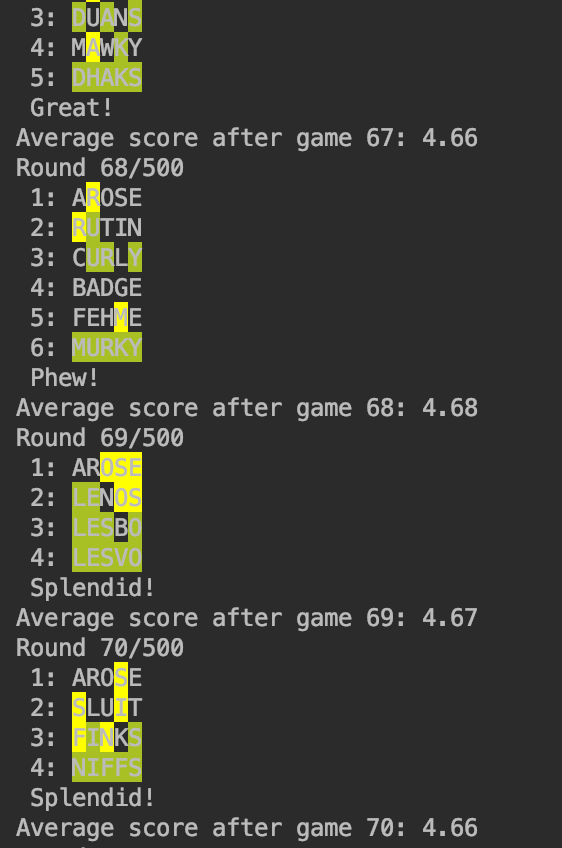
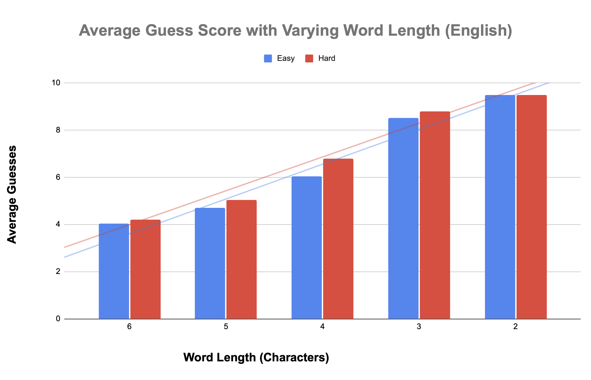

## Wordle AI

###### @Author Luka Didham

### Overview
The purpose of this assignment is to create an an AI agent to play the game Wordle. Wordle is a word guessing game where the player must guess a five-letter word in six attempts.
Each time you guess, you're told whether the letters in your chosen word are in the target word, and whether they are in the right place. Traditionally the target word for the game is picked from a
dictionary of 2500 common English words. The assignment implementation differs by allowing game settings which allow multiple languages, varying word size, and includes much larger dictionaries.
Dictionaries in the implementation contain all words at a given word size for a given language resulting in large dictionaries, with a English five-letter game having a dictionary of nearly 12,000 words.
The agent created is ranked by how few moves it can correctly "guess" the target word, with a penalty that doubles the score if the agent does not guess the word within the variable maximum guess threshold.

### Usage
Simply run, `python wordle.py`to start with standard settings or manually change settings in settings.py
